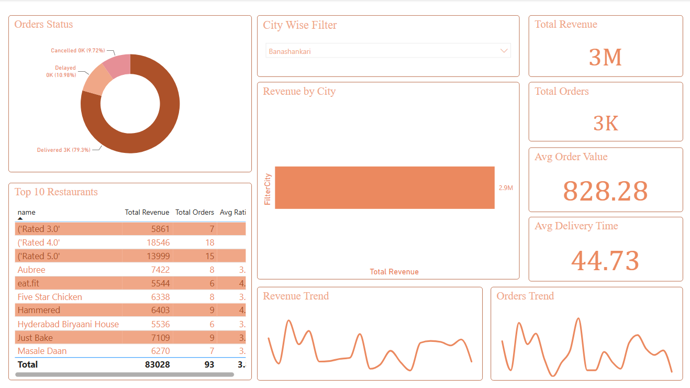
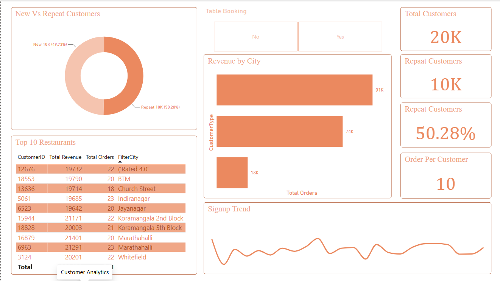
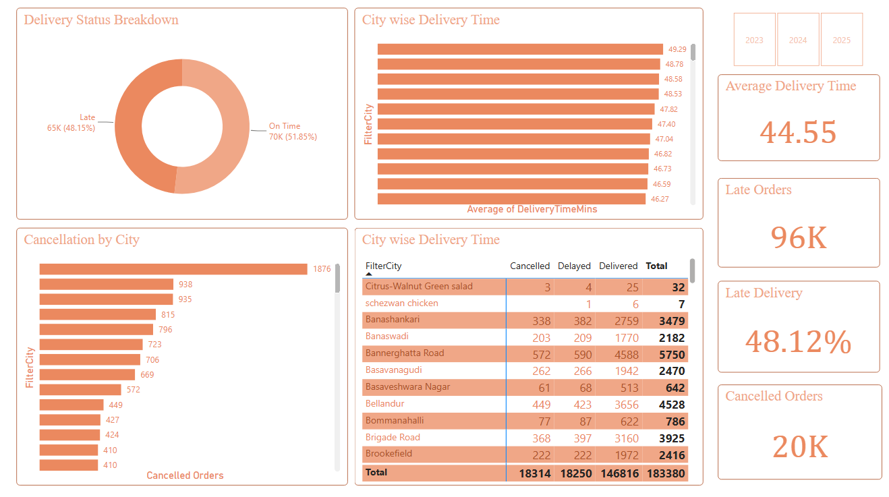
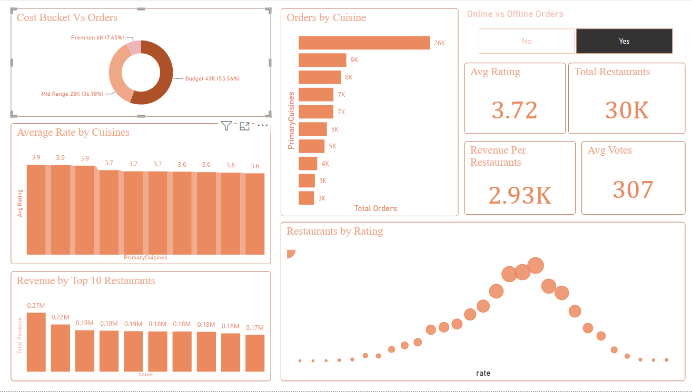
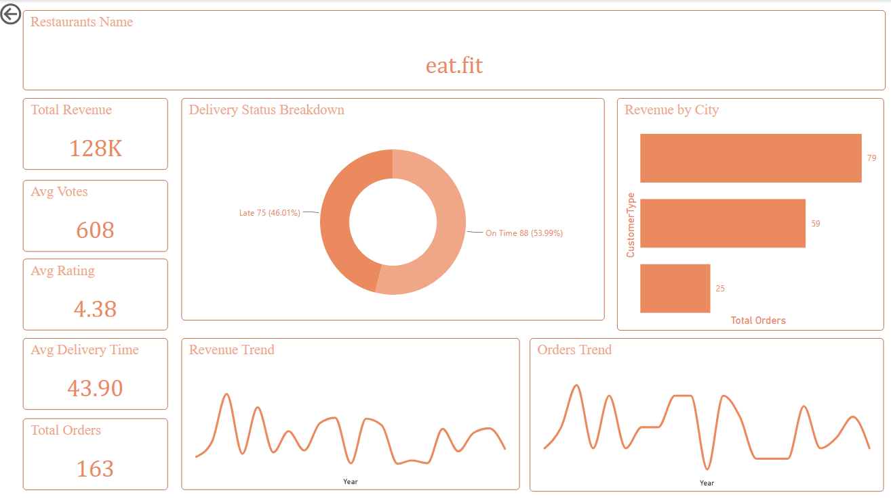
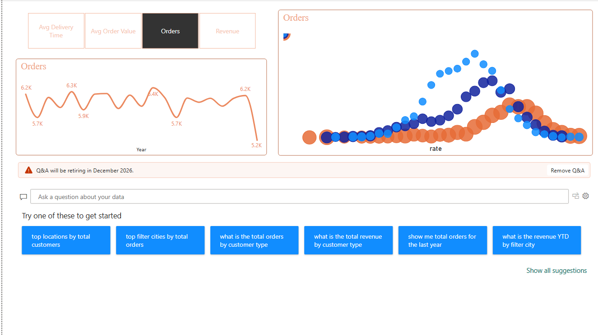

# 🍽️ Food Delivery Analytics Dashboard | Power BI

An interactive Power BI dashboard designed to analyze food delivery,
customer behavior, restaurant performance, delivery operations,
orders, and revenue.

## 📊 Project Overview

This project provides a complete data analytics solution for a
food delivery / restaurant business.

The dashboard transforms raw business data into interactive
visualizations and KPIs that help understand:

- Sales and revenue performance
- Customer behavior
- New vs Repeat customers
- Order trends
- Delivery performance
- Cancellation and delay analysis
- Restaurant performance
- Cuisine performance
- City-wise performance
- Revenue trends
- Advanced business insights

## 🛠️ Tools & Technologies

- Power BI
- Power Query
- DAX
- Data Cleaning
- Data Transformation
- Data Visualization
- Business Intelligence

## 📑 Dashboard Pages

### 1. Executive Overview

Provides a high-level overview of business performance.

Key metrics include:

- Total Revenue
- Total Orders
- Average Order Value
- Average Delivery Time
- Revenue Trend
- Orders Trend
- Order Status

### 2. Customer Analytics

Analyzes customer behavior and customer segmentation.

Key insights include:

- Total Customers
- Repeat Customers
- Repeat Customer %
- Orders per Customer
- New vs Repeat Customers
- Revenue by City
- Signup Trend
- Top Customers / Locations

### 3. Delivery & Operations

Focuses on delivery efficiency and operational performance.

Key metrics include:

- Average Delivery Time
- Late Orders
- Late Delivery %
- Cancelled Orders
- Delivery Status
- City-wise Delivery Time
- Cancellation by City
- Delivered vs Delayed Orders

### 4. Restaurant Performance

Analyzes restaurant-level business performance.

Key insights include:

- Restaurant Revenue
- Restaurant Orders
- Average Rating
- Average Votes
- Revenue per Restaurant
- Cuisine-wise Orders
- Restaurant Rating Distribution
- Top Restaurants by Revenue

### 5. Restaurant Details

Provides a detailed view of an individual restaurant.

Key metrics include:

- Total Revenue
- Total Orders
- Average Rating
- Average Votes
- Average Delivery Time
- Delivery Status
- Revenue by City
- Revenue Trend
- Orders Trend

### 6. Advanced Insights

Provides deeper analysis of restaurant and order behavior.

Key insights include:

- Cost Bucket vs Orders
- Orders by Cuisine
- Average Rating by Cuisine
- Revenue by Top Restaurants
- Restaurants by Rating
- Online vs Offline Orders
- Total Restaurants
- Revenue per Restaurant

## 📈 Key Business Insights

The dashboard can help businesses identify:

1. High-performing restaurants
2. High-revenue cities
3. Customer retention patterns
4. Repeat customer behavior
5. Delivery delays
6. Cancellation patterns
7. Popular cuisines
8. Restaurant rating trends
9. Revenue and order trends
10. Operational improvement opportunities

## 🎯 Business Impact

This dashboard can support data-driven decision making by helping
business teams:

- Improve delivery operations
- Reduce cancellations and delays
- Identify high-value customers
- Improve customer retention
- Identify profitable restaurants
- Analyze city-level performance
- Understand cuisine demand
- Monitor revenue and order trends

## 📸 Dashboard Preview

### Executive Overview

### Customer Analytics

### Delivery & Operations

### Restaurant Performance

### Restaurant Details

### Advanced Insights

## 🚀 How to Use

1. Download the `.pbix` file.
2. Open it using Microsoft Power BI Desktop.
3. Refresh the dataset if the source is available.
4. Explore the dashboard pages.
5. Use filters and interactive visuals to analyze the data.

## 👨‍💻 Author

**Your Name**

Data Analyst | Power BI | SQL | Excel | Python

## ⭐ If you find this project useful

Feel free to star ⭐ this repository and connect with me on LinkedIn.
